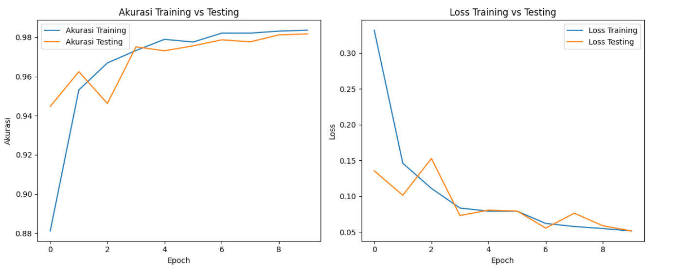
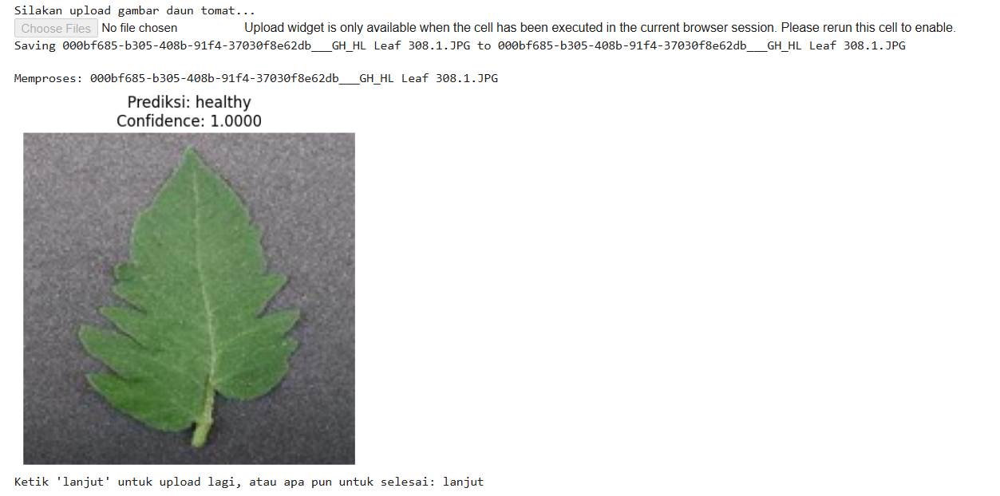

# 🍅 Klasifikasi Daun Tomat Menggunakan Deep Learning

Proyek ini bertujuan untuk membangun model deep learning yang mampu mengklasifikasikan kondisi daun tomat ke dalam empat kategori berdasarkan citra gambar. Tujuannya adalah membantu dalam deteksi dini penyakit tanaman dan meningkatkan praktik pertanian menggunakan klasifikasi gambar berbasis AI.

---

## 🌟 Pencapaian Proyek

✅ Proyek ini telah berhasil diselesaikan sebagai bagian dari program **Coding Camp 2025 - Deep Learning**  
🏅 Mendapatkan **rating bintang 5 ⭐⭐⭐⭐⭐** dari penilaian akhir proyek  
📊 Menyertakan visualisasi **akurasi dan loss training** serta evaluasi hasil model secara menyeluruh  

<div align="center">
  
    
  <p><em>Grafik Akurasi dan Loss Selama Pelatihan</em></p>
  
    
  <p><em>Bukti pencapaian rating bintang 5</em></p>

</div>

---

## 📈 Hasil Evaluasi Model

| Metode Evaluasi             | Akurasi    |
|----------------------------|------------|
| Akurasi Pengujian (Testing) | `0.9870`   |
| Akurasi Akhir Training      | `0.9837`   |
| Akurasi Akhir Validasi      | `0.9817`   |

Model menunjukkan performa sangat baik dengan tingkat akurasi tinggi di seluruh tahap pelatihan dan pengujian.

---

## 📌 Deskripsi Proyek

Model klasifikasi ini menggunakan **Convolutional Neural Network (CNN)** untuk mengklasifikasikan gambar daun tomat ke dalam **empat kelas utama** berikut:

- **Late_blight**
- **Septoria_leaf_spot**
- **Tomato_Yellow_Leaf_Curl_Virus**
- **Healthy**

Dataset yang digunakan merupakan subset dari dataset **PlantVillage** yang difokuskan hanya pada gambar daun tanaman tomat.

---

## 📁 Informasi Dataset

- **Sumber Dataset**: [PlantVillage Dataset dari Kaggle](https://www.kaggle.com/datasets/abdallahalidev/plantvillage-dataset)
- **Total Gambar pada Dataset**: `54.305`
- **Total Gambar Daun Tomat**: `18.160`

Dataset ini berisi gambar daun dari berbagai jenis tanaman dengan berbagai jenis penyakit. Proyek ini hanya menggunakan gambar daun tomat.

---

## 🧠 Arsitektur Model

Model dikembangkan menggunakan **TensorFlow** dan **Keras**, dengan arsitektur **Sequential CNN** yang terdiri dari:

- `Conv2D`
- `MaxPooling2D`
- `Flatten`
- `Dense`
- `Dropout`

Model ini menggunakan fungsi loss `categorical_crossentropy` dan optimizer `Adam`.

---

## ✅ Fitur Utama

- Menggunakan arsitektur CNN dengan model Sequential
- Menangani preprocessing gambar (resize dan normalisasi)
- Mendukung pembagian data menjadi training, validation, dan testing
- Menggunakan augmentasi data untuk generalisasi yang lebih baik
- Mendukung konversi model ke **TF Lite** dan **TFJS** untuk deployment
- Menyediakan antarmuka **inference interaktif** untuk upload gambar dan prediksi real-time

---

## 📦 Output Model

- Format `SavedModel`
- File `model.h5`
- File `converted_model.tflite` untuk perangkat mobile/edge
- Folder `tfjs_model/` untuk deployment web

---

## 🖼️ Kelas Keluaran (Output)

| Label Kelas                          | Deskripsi |
|-------------------------------------|-----------|
| `Late_blight`                       | Penyakit daun tomat yang umum disebabkan oleh *Phytophthora infestans* |
| `Septoria_leaf_spot`               | Penyakit jamur yang disebabkan oleh *Septoria lycopersici* |
| `Tomato_Yellow_Leaf_Curl_Virus`    | Infeksi virus yang menyebabkan daun menguning dan melengkung |
| `Healthy`                          | Daun dalam kondisi sehat tanpa tanda penyakit |

---

## 🔍 Contoh Gambar Inference

Berikut adalah contoh hasil prediksi dari model terhadap gambar daun tomat:

<div align="center">

  
  <p><em>Prediksi: Tomato_Healthy (Confidence: 100%)</em></p>

</div>

---

## 🚀 Cara Penggunaan di Google Colab

1. Upload gambar daun tomat yang ingin diklasifikasi.
2. Model akan memproses gambar dan memberikan prediksi kelas.
3. Hasil prediksi dan tingkat kepercayaan ditampilkan langsung.

---

## 📚 Rencana Pengembangan Selanjutnya

- Deploy model ke aplikasi mobile menggunakan TensorFlow Lite
- Meningkatkan akurasi dengan teknik transfer learning
- Mendukung inference real-time menggunakan webcam
- Membangun antarmuka berbasis web menggunakan TensorFlow.js

---

## 🤝 Ucapan Terima Kasih

Dataset disediakan oleh PlantVillage Project melalui [Kaggle](https://www.kaggle.com/datasets/abdallahalidev/plantvillage-dataset).  
Terima kasih kepada komunitas open-source dan TensorFlow yang telah menyediakan alat-alat hebat untuk pengembangan model AI.

---

---

## 🛠️ Cara Instalasi dan Penggunaan Virtual Environment (`myvenv`)

Untuk menjalankan proyek ini secara lokal, disarankan menggunakan virtual environment agar lingkungan kerja tetap bersih dan terisolasi.

### 1. Install dan Aktifkan `myvenv`

```bash
# Membuat virtual environment
python -m venv myvenv

# Aktivasi (Linux/MacOS)
source myvenv/bin/activate

# Aktivasi (Windows)
myvenv\Scripts\activate
```

### 2. Install Dependencies

Setelah mengaktifkan `myvenv`, install semua dependensi yang dibutuhkan:

```bash
pip install -r requirements.txt
```

### 3. Menjalankan Proyek

Setelah semua dependensi terpasang, Anda bisa menjalankan training, evaluasi model, atau inference secara lokal sesuai dengan script yang tersedia.

---

## 🧪 Menjalankan di Google Colab

Jika Anda lebih memilih untuk menjalankan proyek ini di **Google Colab**, ikuti langkah-langkah berikut:

1. Buka file notebook `.ipynb` dari repositori ini menggunakan Google Colab.
2. Upload gambar daun tomat melalui antarmuka upload file di Colab.
3. Jalankan seluruh sel untuk memproses gambar dan mendapatkan prediksi.
4. Hasil prediksi akan ditampilkan langsung, lengkap dengan tingkat kepercayaan model.

---

